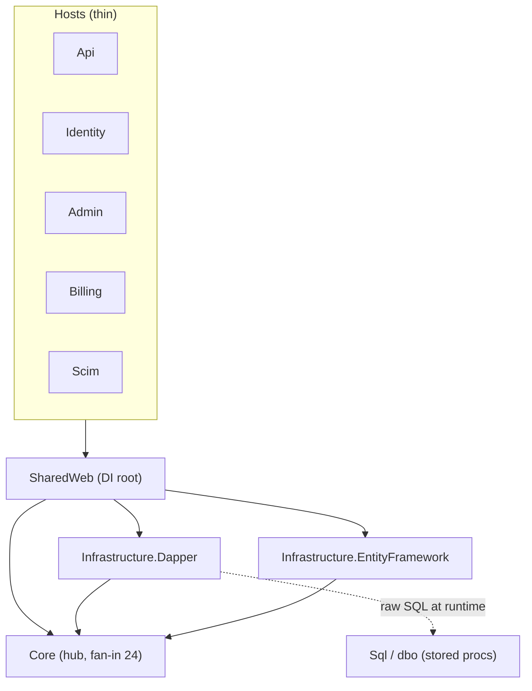

# 10xArchitect Report — bitwarden/server

> A two-pager synthesizing five analysis artifacts (L2 repo map → L3 feature research → L4 refactor plan → L5 DDD notes), **all produced from the single repository `bitwarden/server`**. Every structural claim traces to an artifact. No production code was changed in any layer.

---

## 1. Projects described

**`bitwarden/server`** — the C#/.NET backend monolith for Bitwarden (the APIs, database, and core infrastructure behind all Bitwarden clients).

- **Stack:** .NET 10 / C#; ten thin web hosts (`Api`, `Identity`, `Admin`, `Billing`, `Events`, `EventsProcessor`, `Icons`, `Notifications`, + commercial `Scim`/`Sso`) over one large business library `Core`. **Dual data-access**: Dapper + T-SQL stored procedures (SqlServer/cloud) _and_ a parallel Entity Framework path (Postgres/MySql/Sqlite/self-host), chosen at runtime.
- **Rough scale:** multi-year, large codebase; ~1,461 non-merge commits in the last 12 months alone; `Core/AdminConsole` is the busiest module (~1,048 commits/yr), `Core/Billing` #2 (~621). Stripe.net leaks into **~114 files** across 5 layer groups. `Core/Constants.cs` holds 147 feature-flag keys.
- **One repo, five layers of analysis:** the L2 repo map, the L3 org-member-invite feature research, the L4 refactor plan, and the L5 DDD domain/invariant/ACL notes **all came from this one repository.**

## 2. Project map (from L2)

Key takeaways:

1. **Local hubs:** `Core` is the hub (fan-in 24); `SharedWeb` is the DI composition root (fan-in 12) — one ~800-line `ServiceCollectionExtensions.cs` decides the live data layer for every host.
2. **Highest systemic risk — the dual data-access seam:** `Dapper ↔ EF ↔ Sql/dbo` is runtime-switched on `GlobalSettings.DatabaseProvider` (`ServiceCollectionExtensions.cs:98-124`); most repository changes must be written twice or thrice, and the `Sql/dbo` stored-proc layer is a `.sqlproj` **invisible to the C# build graph** (git co-change Dapper↔EF 92, EF↔Sql 90).
3. **Busiest risk zone:** `Core/AdminConsole` (orgs/members/policies) — #1 every quarter, with a 5-layer vertical slice (controller → service → EF repo → Dapper repo → stored proc → migration) easy to under-scope.
4. **Entry points & first reads:** `bitwarden-server.slnx`, `SharedWeb/Utilities/ServiceCollectionExtensions.cs` (the data-layer switch), `Core/Constants.cs` (a live index of in-flight features), `Api/AdminConsole/Controllers/OrganizationUsersController.cs` (the hottest controller).
5. **Most important unknowns:** runtime DI bindings, the stored-proc↔Dapper call mapping, and the test-runner's enabled DB providers are untooled — proven by neither the project graph nor git, only by reading source or running the app.

## 3. Feature analysis (from L3)

**Flow chosen:** the organization **member invite → accept → confirm** lifecycle — the busiest slice of the busiest module (`Core/AdminConsole`).

**Overview:** three thin HTTP actions on `OrganizationUsersController` drive the lifecycle. An admin **invites** (member row created `Status=Invited`, token-bearing email sent, `OrganizationUserRepository.CreateManyAsync`); the invitee **accepts** via emailed token (`Status=Accepted`, `UserId` bound, `Email` nulled, `ReplaceAsync`); an admin **confirms** (`Status=Confirmed`, org `Key` set, `ReplaceManyAsync`, account keys pushed). Each stage delegates to a Core orchestrator that validates permissions/policies, writes through `IOrganizationUserRepository`, and fires external seams (email/push/events/billing/crypto-token). Returns are thin success/per-row results.

**Trade-offs (intent-verified — the honest core of this analysis):** the three items first flagged as "technical debt" were intent-checked and reclassified as **essential complexity or active migration — GUARD, not rebuild**:

1. **Dual Dapper/EF/Sql seam — ESSENTIAL** (cloud-vs-self-host multi-DB product matrix). Confirmed via ast-grep: exactly two concrete `IOrganizationUserRepository` impls, single binding site (`ServiceCollectionExtensions.cs:98-124`); the proven 5-way atomic change is commit `4de10c83` (Dapper + EF + proc + migrator + parity test). Residual cost: silent cross-engine drift.
2. **Hand-written bulk OPENJSON stored procs — ESSENTIAL** (performance; origin commit `785e788cb` "Support large organization sync"). Residual cost: proc↔migration atomicity is convention (~65% same-commit), not build-enforced.
3. **Two invite paths behind flags — ESSENTIAL, in-flight Strangler Fig** (`PublicMembersInviteRefactor = "pm-33398-..."`, ast-grep confirmed). **The one genuine residual debt** is the **invite-migration flag lifecycle**: two independent flags + an unflagged legacy web path + no cutover/cleanup commit yet — flips toward accidental debt if migration activity stops.

Verification tally for this L3 feature analysis (ast-grep 0.43.0, rg-cross-checked): **17 CONFIRMED · 5 REFINED · 2 REFUTED** of 24 claims. (The separate L4 refactor research carries its own tally: 13 / 4 / 0 of 17.)

## 4. Refactor plan (from L4)

**Chosen option — the SAFE SLICE:** _complete the invite-command Strangler Fig_ for the **web/AdminConsole** surface only. After filtering, this was the **single genuine structural candidate** (all others were essential complexity, test gaps, or config). Target shape: the web invite routes through the already-built `InviteOrganizationUsersCommand` + validator pipeline, via a new web-specific wrapper — shipped **inert behind a flag, OFF by default**.

**Consciously NOT doing:** no flag flip to default-on; no deletion of legacy `OrganizationService.InviteUsersAsync`; no flag retirement; no import/provider surfaces — all maintainer-owned in-flight work.

**Phases (each its own reversible PR):**

- **Phase 0 — Spike:** prove the test host can mint an `OrgUserInviteTokenable` and POST `/accept` with **zero production-code changes** (gates the whole plan).
- **Phase 1 — Characterization test:** pin current legacy invite→accept→confirm behavior + legacy error contracts before touching production code.
- **Phase 2 — Inert flag-gated web wrapper:** new web-specific command wrapper, flag OFF, byte-identical at merge.

**Verification.** Auto: `dotnet test ./test` (CI `test.yml`, SQLite in-memory) for Phase 1/2; the 5-DB Dapper↔EF parity guard `test-database.yml` is _not_ expected to trigger (control-flow-only slice). Manual: event-actor review. _Caveat:_ whether the 5-DB matrix actually runs every provider is gated by `BW_TEST_*` env and is `unknown` from source.

**Biggest-risk catch:** reusing the Imported wrapper would silently relabel every web invite audit event as `EventSystemUser.PublicApi` (`InviteOrganizationUsersCommand.cs:65/99`) — and the parity test **cannot catch it** (events config-disabled in the test host), so Phase 2 must build a new web wrapper and the event-actor check is enforced by **review**.

## 5. Domain via DDD (from L5)

**Ubiquitous language (key concepts):** **Organization** (the paid tenant), **OrganizationUser/"Member"** (the User↔Organization association), **OrganizationUserStatusType** (the lifecycle: `Invited → Accepted → Confirmed`, `Revoked=-1`), **Policy** (22 governance types gating transitions), **Key** (org symmetric key encrypted to a member's public key — set at Confirm, the zero-knowledge core seam).

**Most important model-vs-code mismatch** (note: no PRD exists, so "model" = the code's own docstrings/intent, not a spec): the membership lifecycle _implies_ a state machine, but there is **no state-machine aggregate** — `Status` is a plain enum field set imperatively across 9+ sites. Most surprising: for pre-snapshot revoked rows, prior status is **reverse-engineered from the null-pattern** of `UserId`/`Email`/`Key` (`OrganizationUser.GetPriorActiveOrganizationUserStatusType`, `OrganizationUser.cs:126-138`) — lifecycle state inferred from incidental field arrangement, correct only while a never-enforced field-consistency invariant holds.

**Invariant #1 & its aggregate:** **I1 — membership lifecycle state machine** (`Invited → Accepted → Confirmed`, `Revoked ⇄ prior`); chosen as the #1 refactor target because it is simultaneously most-core and weakest-enforced (declared-only, Confirm _swallows_ its guard at `ConfirmOrganizationUserCommand.cs:170-173`). Proposed home: a guardian **`OrganizationMembership`** aggregate owning the transition table and field-consistency assertions (a design target — single-transaction atomicity across the dual stack would need per-provider verification).

**Anti-Corruption Layer:** the worst dependency leak is **Stripe.net** — **101 files in `src/` + 13 in `bitwarden_license/` = ~114**, across 5 layer groups (Core 63 · Billing-host 28 · Api 6 · Admin 4 · commercial 7 src + 6 test). Intent-vs-code gap: a `GatewayType` enum declares seven interchangeable gateways, yet the only seam (`IStripeAdapter`) is Stripe-typed; Stripe types even reach API wire contracts. Plan: domain value objects + a narrow `IPaymentGateway` port + a single Stripe adapter (entities are already clean; infra has 0 Stripe references).

## 6. Decisions that belong to me

(a) **I chose `bitwarden/server`** because I use the product personally and know it well — I prioritized domain-comprehension speed over picking a "cleaner" but unfamiliar repo, accepting a messier codebase as the trade. (b) **I chose the AdminConsole org-member-invite flow** for the deep dive because it is the repo's center of gravity — busiest module, widest blast radius — and it chains naturally into the L4 refactor and L5 domain work. (c) **Most importantly, I pushed back on the agent's "technical debt" labeling:** I recognized the dual Dapper/EF stack and hand-written SQL as _deliberate_ engineering (multi-DB product matrix + performance), and an intent-check confirmed all three flagged items were essential/guard rather than rebuild — the unverified draft would have aimed a refactor at code that should not be touched. (d) **I deliberately scoped the L4 plan to a safe slice** (characterization test + inert flag-gated wrapper, no flag flip, no legacy deletion), out of respect for it being maintainer-owned, in-flight Strangler Fig work.
