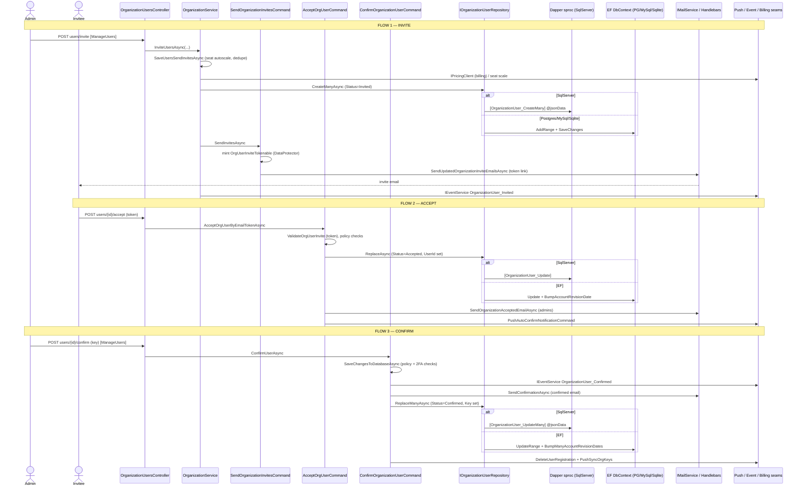

# Org Member Invite / Accept / Confirm — End-to-End Trace

Lens: TRACE END-TO-END. Repo: `bitwarden/server`. Describes CURRENT state only; no refactor proposed.
All evidence is `file:line` from opened files. Items marked `unknown` could not be pinned.

---

## Summary of the three flows

| Flow        | HTTP entry                                           | Core orchestrator                                                                | Data write                                                                    | Email/Push seam                                                                                                              |
| ----------- | ---------------------------------------------------- | -------------------------------------------------------------------------------- | ----------------------------------------------------------------------------- | ---------------------------------------------------------------------------------------------------------------------------- |
| **Invite**  | `POST org/{orgId}/users/invite`                      | `OrganizationService.InviteUsersAsync` → `SaveUsersSendInvitesAsync`             | `OrganizationUserRepository.CreateManyAsync` / `CreateAsync` (Status=Invited) | `SendOrganizationInvitesCommand` → `IMailService.SendUpdatedOrganizationInviteEmailsAsync` (invite email w/ protected token) |
| **Accept**  | `POST org/{orgId}/users/{organizationUserId}/accept` | `AcceptOrgUserCommand.AcceptOrgUserByEmailTokenAsync` → `AcceptOrgUserAsync`     | `OrganizationUserRepository.ReplaceAsync` (Status=Accepted)                   | `SendOrganizationAcceptedEmailAsync` to admins + `IPushAutoConfirmNotificationCommand.PushAsync`                             |
| **Confirm** | `POST org/{orgId}/users/{id}/confirm`                | `ConfirmOrganizationUserCommand.ConfirmUserAsync` → `SaveChangesToDatabaseAsync` | `OrganizationUserRepository.ReplaceManyAsync` (Status=Confirmed, sets Key)    | `SendOrganizationConfirmationCommand` (confirmed email) + push sync org keys                                                 |

---

## FLOW 1 — INVITE

1. **HTTP entry.** `POST .../invite`, gated by `[Authorize<ManageUsersRequirement>]`.
   `src/Api/AdminConsole/Controllers/OrganizationUsersController.cs:268-288`
   - Optional collection-access authorization check (`BulkCollectionOperations.ModifyUserAccess`) at `:273-283`.
   - Delegates: `_organizationService.InviteUsersAsync(orgId, userId, systemUser: null, [(new OrganizationUserInvite(model.ToData()), null)])` at `:286-287`.

2. **Core service — permission validation + dispatch.** `OrganizationService.InviteUsersAsync`
   `src/Core/AdminConsole/Services/Implementations/OrganizationService.cs:470-504`
   - Validates inviter update permissions / custom-permission feature when `invitingUserId` present (`:479-487`).
   - Calls `SaveUsersSendInvitesAsync(...)` (`:489`).
   - Logs `EventType.OrganizationUser_Invited` events via `IEventService` (SCIM system-user vs client-app branch) (`:491-501`). **External seam: event logging.**

3. **Core service — build + persist + send.** `OrganizationService.SaveUsersSendInvitesAsync`
   `src/Core/AdminConsole/Services/Implementations/OrganizationService.cs:506-700`
   - Loads org, dedupes against `SelectKnownEmailsAsync` (`:512-521`).
   - Seat autoscaling (PM + Secrets Manager) incl. `_pricingClient.GetPlanOrThrow` (**billing seam**) (`:523-556`).
   - Confirmed-owner guard (`:558-564`).
   - Builds `OrganizationUser` entities with `Status = OrganizationUserStatusType.Invited`, `UserId = null`, lowercased Email (`:585-597`).
   - **DATA WRITE:** `_organizationUserRepository.CreateManyAsync(orgUsersWithoutCollections)` (`:639`) and per-user `CreateAsync(orgUser, collections)` for collection-scoped invites (`:642`); group assignments via `UpdateGroupsAsync` (`:648`).
   - `AutoAddSeatsAsync` + SM subscription update (`:656-661`).
   - **EMAIL SEAM:** `SendInvitesAsync(allOrgUsers, organization, invitingUserId)` (`:663`) → `_sendOrganizationInvitesCommand.SendInvitesAsync(new SendInvitesRequest(... initOrganization:false ...))` (`:702-703`).
   - Compensating rollback (delete created users + revert autoscale) on exception (`:665-692`).

4. **Email command — token mint + mail.** `SendOrganizationInvitesCommand`
   `src/Core/AdminConsole/OrganizationFeatures/OrganizationUsers/InviteUsers/SendOrganizationInvitesCommand.cs:27-95`
   - `SendInvitesAsync` builds `OrganizationInvitesInfo` and calls `mailService.SendUpdatedOrganizationInviteEmailsAsync(orgInvitesInfo)` (`:27-33`).
   - **Token minting (external/crypto seam):** per org user, `orgUserInviteTokenableFactory.CreateToken(orgUser)` then `dataProtectorTokenFactory.Protect(...)` → `ExpiringToken` (`:66-71`). Token type `OrgUserInviteTokenable` (`IDataProtectorTokenFactory<OrgUserInviteTokenable>`, ctor `:24`).
   - Resolves inviter email + checks SSO/RequireSso policy to shape the email link (`:55-62`, `:86-95`).

5. **Mail rendering (external SMTP seam).** `HandlebarsMailService.SendUpdatedOrganizationInviteEmailsAsync`
   `src/Core/Platform/Mail/HandlebarsMailService.cs:366-373` — builds `OrganizationUserInvitedViewModel.CreateFromInviteInfo(... orgUserTokenPair.Token ...)`; token URL-encoded into the accept link (URL-encode pattern at `:71`,`:87`,`:112`,`:132`). Actual send is the configured `IMailDeliveryService` (**SMTP/SES external boundary** — provider impl `unknown`, not opened).

### Invite DATA-ACCESS dual stack (`CreateManyAsync`)

- **Provider switch (runtime):** `ServiceCollectionExtensions.AddDatabaseRepositories` — `provider != SqlServer` ⇒ `AddPasswordManagerEFRepositories`; else `AddDapperRepositories`. `src/SharedWeb/Utilities/ServiceCollectionExtensions.cs:98-124`; provider derived from `GlobalSettings.DatabaseProvider` in `GetDatabaseProvider` (`:816-851`).
- **Dapper (SqlServer):** `OrganizationUserRepository.CreateManyAsync` sets new IDs, serializes users to JSON, executes sproc `[dbo].[OrganizationUser_CreateMany]` with `@jsonData`.
  `src/Infrastructure.Dapper/AdminConsole/Repositories/OrganizationUserRepository.cs:489-513`
  - Collection-scoped path `CreateAsync` → sproc `[dbo].[OrganizationUser_CreateWithCollections]` (`:384-398`).
  - Sproc: bulk `INSERT INTO [dbo].[OrganizationUser]` from `OPENJSON(@jsonData)`. `src/Sql/dbo/Stored Procedures/OrganizationUser_CreateMany.sql:1-15+`.
- **EF (Postgres/MySql/Sqlite):** `OrganizationUserRepository.CreateManyAsync` maps to EF entities, `dbContext.AddRangeAsync` + `SaveChangesAsync`.
  `src/Infrastructure.EntityFramework/AdminConsole/Repositories/OrganizationUserRepository.cs:62-84`
- **Migrator:** sproc deployed via `util/Migrator/DbScripts/*.sql` (idempotent date-prefixed scripts; SqlServer only). Exact script that introduced `OrganizationUser_CreateMany` `unknown` (not bisected).

---

## FLOW 2 — ACCEPT

1. **HTTP entry.** `POST .../{organizationUserId}/accept` (no ManageUsers gate — self-accept).
   `src/Api/AdminConsole/Controllers/OrganizationUsersController.cs:336-365`
   - Resolves current user via `_userService.GetUserByPrincipalAsync` (`:339`).
   - Loads org user, asserts `OrganizationId == orgId` (`:345-349`).
   - Checks ResetPassword auto-enroll requirement (`_policyRequirementQuery.GetAsync<ResetPasswordPolicyRequirement>`) (`:351-357`).
   - Delegates: `_acceptOrgUserCommand.AcceptOrgUserByEmailTokenAsync(organizationUserId, user, model.Token, _userService)` (`:359`).
   - If auto-enroll: `_updateUserResetPasswordEnrollmentCommand.UpdateUserResetPasswordEnrollmentAsync(...)` (`:361-364`).

2. **Core command — token validation.** `AcceptOrgUserCommand.AcceptOrgUserByEmailTokenAsync`
   `src/Core/AdminConsole/OrganizationFeatures/OrganizationUsers/AcceptOrgUserCommand.cs:60-104`
   - Loads org user via `_organizationUserRepository.GetByIdAsync` (`:63`).
   - **Token verify (crypto seam):** `OrgUserInviteTokenable.ValidateOrgUserInvite(_orgUserInviteTokenDataFactory, emailToken, orgUser.Id, orgUser.Email)` (`:69-75`).
   - Already-member / email-match guards (`:77-92`).
   - Calls `AcceptOrgUserAsync` (`:94`); marks `user.EmailVerified = true` + `_userRepository.ReplaceAsync(user)` if needed (`:96-101`).

3. **Core command — state transition + side effects.** `AcceptOrgUserCommand.AcceptOrgUserAsync`
   `src/Core/AdminConsole/OrganizationFeatures/OrganizationUsers/AcceptOrgUserCommand.cs:140-194`
   - Status guards: Revoked / not-Invited (`:143-151`); free-org single-admin guard (`:153-165`).
   - Policy enforcement: AutomaticUserConfirmation, SingleOrganization, RequireTwoFactor (`:169-174`, helpers `:196-260`).
   - **STATE:** `orgUser.Status = Accepted`, `orgUser.UserId = user.Id`, `orgUser.Email = null` (`:176-178`).
   - **DATA WRITE:** `_organizationUserRepository.ReplaceAsync(orgUser)` (`:180`).
   - **EMAIL SEAM:** notifies admins — `_mailService.SendOrganizationAcceptedEmailAsync(organization, user.Email, adminEmails)` (`:182-189`).
   - **PUSH SEAM:** `_pushAutoConfirmNotificationCommand.PushAsync(user.Id, orgUser.OrganizationId)` (`:191`).

### Accept DATA-ACCESS dual stack (`ReplaceAsync`)

- **Dapper:** base `Repository.ReplaceAsync` → `[dbo].[OrganizationUser_Update]` (generic `{Table}_Update`); concrete file overrides exist but single-entity replace uses base sproc. `unknown` exact line in Dapper concrete (base path `src/Infrastructure.Dapper/Repositories/Repository.cs`).
- **EF:** `OrganizationUserRepository.ReplaceAsync` override → `base.ReplaceAsync` then `UserBumpAccountRevisionDateAsync(UserId)`.
  `src/Infrastructure.EntityFramework/AdminConsole/Repositories/OrganizationUserRepository.cs:620-634`

---

## FLOW 3 — CONFIRM

1. **HTTP entry.** `POST .../{id}/confirm`, gated `[Authorize<ManageUsersRequirement>]`.
   `src/Api/AdminConsole/Controllers/OrganizationUsersController.cs:367-373`
   - `_confirmOrganizationUserCommand.ConfirmUserAsync(orgId, id, model.Key, userId, model.DefaultUserCollectionName)` (`:372`).
   - Bulk variant: `POST .../confirm` → `ConfirmUsersAsync(...)` (`:375-385`).

2. **Core command — orchestrate.** `ConfirmOrganizationUserCommand.ConfirmUserAsync`
   `src/Core/AdminConsole/OrganizationFeatures/OrganizationUsers/ConfirmOrganizationUserCommand.cs:68-93`
   - Loads org (`:71`), calls `SaveChangesToDatabaseAsync(orgId, {id:key}, confirmingUserId, org)` (`:73-77`).
   - `CreateManyDefaultCollectionsAsync` (Org Data Ownership policy → `_collectionRepository.CreateDefaultCollectionsAsync`) (`:90`, impl `:267-301`).

3. **Core command — validate + persist.** `ConfirmOrganizationUserCommand.SaveChangesToDatabaseAsync`
   `src/Core/AdminConsole/OrganizationFeatures/OrganizationUsers/ConfirmOrganizationUserCommand.cs:112-180`
   - Filters to `Status == Accepted && OrganizationId match && UserId != null` (`:115-118`).
   - Loads users, 2FA-enabled query, policy checks (`CheckPoliciesAsync` `:182-225`): RequireTwoFactor, AutomaticUserConfirmation, SingleOrganization.
   - Free-org single-admin guard (`:148-157`).
   - **STATE:** `orgUser.Status = Confirmed`, `orgUser.Key = keys[id]`, `orgUser.Email = null` (`:161-163`).
   - **EVENT SEAM:** `_eventService.LogOrganizationUserEventAsync(orgUser, EventType.OrganizationUser_Confirmed)` (`:165`).
   - **EMAIL SEAM:** `SendOrganizationConfirmedEmailAsync` → `_sendOrganizationConfirmationCommand.SendConfirmationAsync(organization, user.Email, orgUser.AccessSecretsManager)` (`:166`, impl `:309-312`).
   - **DATA WRITE:** `_organizationUserRepository.ReplaceManyAsync(succeededUsers)` (`:176`).
   - **PUSH SEAM:** `DeleteAndPushUserRegistrationAsync` — `_pushRegistrationService.DeleteUserRegistrationOrganizationAsync` + `_pushNotificationService.PushSyncOrgKeysAsync` (`:177`, impl `:242-251`).

### Confirm DATA-ACCESS dual stack (`ReplaceManyAsync`)

- **Dapper (SqlServer):** `ReplaceManyAsync` serializes users to JSON, executes sproc `[dbo].[OrganizationUser_UpdateMany]`.
  `src/Infrastructure.Dapper/AdminConsole/Repositories/OrganizationUserRepository.cs:515-532`; sproc `src/Sql/dbo/Stored Procedures/OrganizationUser_UpdateMany.sql`.
- **EF (Postgres/MySql/Sqlite):** `ReplaceManyAsync` → `dbContext.UpdateRange` + `SaveChangesAsync` + `UserBumpManyAccountRevisionDatesAsync`.
  `src/Infrastructure.EntityFramework/AdminConsole/Repositories/OrganizationUserRepository.cs:695-706`

---

## DI wiring (commands resolved at controller ctor)

`src/Core/OrganizationFeatures/OrganizationServiceCollectionExtensions.cs`

- `IConfirmOrganizationUserCommand → ConfirmOrganizationUserCommand` (`:156`)
- `IAcceptOrgUserCommand → AcceptOrgUserCommand` (`:230`)
- `ISendOrganizationInvitesCommand → SendOrganizationInvitesCommand` (`:242`)

Repository selection is runtime per `GlobalSettings.DatabaseProvider` (Dapper sproc stack for SqlServer, EF for everything else) — `src/SharedWeb/Utilities/ServiceCollectionExtensions.cs:98-124`, `816-851`.

---

## External seams summary

- **SMTP/email** (`IMailService` → `HandlebarsMailService` → `IMailDeliveryService`): invite email (token link), accept-notification to admins, confirmed email. Delivery provider impl not opened — `unknown`.
- **Push** (`IPushNotificationService` / `IPushRegistrationService` / `IPushAutoConfirmNotificationCommand`): accept + confirm trigger device push / sync-org-keys.
- **Events** (`IEventService`): Invited / Confirmed audit logging (Table Storage in cloud per DI `:118`).
- **Billing** (`IPricingClient`, `IUpdateSecretsManagerSubscriptionCommand`): seat autoscaling during invite.
- **Crypto/Tokens** (`IDataProtectorTokenFactory<OrgUserInviteTokenable>`): invite token mint (send) + validate (accept).

## Could-not-pin (`unknown`)

- Exact Dapper concrete vs base line for single `ReplaceAsync` (Accept) sproc dispatch — base `Repository.ReplaceAsync` confirmed at `src/Infrastructure.Dapper/Repositories/Repository.cs:46`, `{Table}_Create` at `:55`; `{Table}_Update` not line-confirmed.
- Migrator script filename that first introduced `OrganizationUser_CreateMany` / `OrganizationUser_UpdateMany` sprocs.
- Concrete `IMailDeliveryService` SMTP/SES implementation (not opened).

---

## Mermaid — sequence (invite → accept → confirm)

