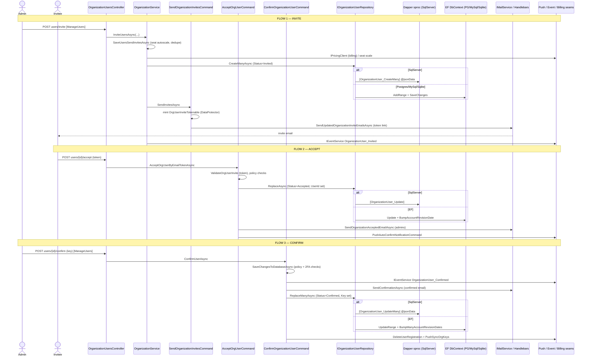

# Research — Org Member Invite / Accept / Confirm (AdminConsole)

> **Goal:** Map the current-state organization member invite → accept → confirm flow in `bitwarden/server` and surface its real technical debt and structural risks, with every claim traceable to `file:line` or git evidence, as decision input before any change.

_Synthesis of `_trace.md`, `_test-gaps.md`, `_blast-radius.md` (this feature) over the L2 `repo-map.md`. Current-state analysis only — NO refactor proposed. Items not statically verifiable are marked `unknown`._

---

## Feature overview

Three HTTP actions on `OrganizationUsersController` drive the org-membership lifecycle. An admin **invites** (member created `Status=Invited`, token-bearing email sent); the invitee **accepts** via emailed token (`Status=Accepted`, `UserId` bound); an admin **confirms** (`Status=Confirmed`, org `Key` set, account keys pushed). Each stage is a thin controller action delegating to a Core orchestrator that validates permissions/policies, writes through the repository seam, and fires external seams (email/push/events/billing/crypto-token).

### Condensed e2e path (key `file:line`)

| Stage       | Entry                                                                        | Core orchestrator                                                                                    | Data write (state)                                                                           | Key external seams                                                                                                                                                                       |
| ----------- | ---------------------------------------------------------------------------- | ---------------------------------------------------------------------------------------------------- | -------------------------------------------------------------------------------------------- | ---------------------------------------------------------------------------------------------------------------------------------------------------------------------------------------- |
| **Invite**  | `OrganizationUsersController.cs:268-288` `[ManageUsers]`                     | `OrganizationService.InviteUsersAsync` `:470` → `SaveUsersSendInvitesAsync` `:508`                   | `OrganizationUserRepository.CreateManyAsync` `:639` / `CreateAsync` `:642` (Status=Invited)  | billing (`IPricingClient` `:523-556`), event (`OrganizationUser_Invited` `:491-501`), token mint + email (`SendOrganizationInvitesCommand.cs:66-71`, `HandlebarsMailService.cs:366-373`) |
| **Accept**  | `OrganizationUsersController.cs:336-365` (self, no ManageUsers)              | `AcceptOrgUserCommand.AcceptOrgUserByEmailTokenAsync` `:60-104` → `AcceptOrgUserAsync` `:140-194`    | `OrganizationUserRepository.ReplaceAsync` `:180` (Status=Accepted, UserId set, Email=null)   | token verify (`ValidateOrgUserInvite` `:69-75`), admin email (`SendOrganizationAcceptedEmailAsync` `:182-189`), push (`IPushAutoConfirmNotificationCommand.PushAsync` `:191`)            |
| **Confirm** | `OrganizationUsersController.cs:367-373` `[ManageUsers]` (+ bulk `:375-385`) | `ConfirmOrganizationUserCommand.ConfirmUserAsync` `:68-93` → `SaveChangesToDatabaseAsync` `:112-180` | `OrganizationUserRepository.ReplaceManyAsync` `:176` (Status=Confirmed, Key set, Email=null) | event (`OrganizationUser_Confirmed` `:165`), confirmed email (`SendConfirmationAsync` `:166`), push (`DeleteUserRegistration` + `PushSyncOrgKeysAsync` `:177`)                           |

Commands are resolved at the controller ctor via DI in `OrganizationServiceCollectionExtensions.cs` (`IConfirmOrganizationUserCommand:156`, `IAcceptOrgUserCommand:230`, `ISendOrganizationInvitesCommand:242`).

### Dual data-access split (the defining structural fact)

Every write on this flow passes through `IOrganizationUserRepository`, whose concrete impl is chosen **at runtime by `GlobalSettings.DatabaseProvider`** in `ServiceCollectionExtensions.cs:98-124` (resolved at `:816-851`): `SqlServer` → Dapper + T-SQL stored procs; Postgres/MySql/Sqlite → EF Core.

| Method                                            | Dapper (SqlServer)                                                                                                                                                                                                                                                                  | EF (PG/MySql/Sqlite)                                                                                     |
| ------------------------------------------------- | ----------------------------------------------------------------------------------------------------------------------------------------------------------------------------------------------------------------------------------------------------------------------------------- | -------------------------------------------------------------------------------------------------------- |
| `CreateManyAsync`                                 | sproc `[OrganizationUser_CreateMany]` (`Infrastructure.Dapper/.../OrganizationUserRepository.cs:489-513`)                                                                                                                                                                           | `AddRangeAsync`+`SaveChanges` (`Infrastructure.EntityFramework/.../OrganizationUserRepository.cs:62-84`) |
| `ReplaceAsync` (single-arg, the Accept-flow call) | inherits base `Repository<T,TId>.ReplaceAsync(T)` at `Infrastructure.Dapper/Repositories/Repository.cs:63` → executes `[{Schema}].[{Table}_Update]` `:68` = `[dbo].[OrganizationUser_Update]` (Dapper `OrganizationUserRepository` does **not** override single-arg `ReplaceAsync`) | override `:620-634` (+`UserBumpAccountRevisionDateAsync`)                                                |
| `ReplaceManyAsync`                                | sproc `[OrganizationUser_UpdateMany]` (`:515-532`)                                                                                                                                                                                                                                  | `UpdateRange`+`SaveChanges` (`:695-706`, +`UserBumpManyAccountRevisionDatesAsync`)                       |

The stored procs live in `src/Sql/dbo/...` (a `.sqlproj` invisible to the C# build graph) and are deployed via hand-written date-prefixed scripts in `util/Migrator/DbScripts/`.

### External seams summary

- **SMTP/email** (`IMailService`→`HandlebarsMailService`→`IMailDeliveryService`): invite (token link), accept-notify-admins, confirmed. Concrete `IMailDeliveryService` impl is **config-selected at runtime** in `SharedWeb/Utilities/ServiceCollectionExtensions.cs:313-328` — 5 impls exist: AWS-SES+SendGrid both set → `MultiServiceMailDeliveryService` (`:316`), AWS only → `AmazonSesMailDeliveryService` (`:320`), SMTP host set → `MailKitSmtpMailDeliveryService` (`:324`), else → `NoopMailDeliveryService` (`:328`). Cloud prod typically AmazonSes/Multi; self-hosted typically MailKit SMTP. _(was `unknown`)_
- **Push** (`IPushNotificationService`/`IPushRegistrationService`/`IPushAutoConfirmNotificationCommand`): accept + confirm.
- **Events** (`IEventService`): Invited/Confirmed audit (Table Storage in cloud, DI `:118`).
- **Billing** (`IPricingClient`, `IUpdateSecretsManagerSubscriptionCommand`): seat autoscaling during invite, with compensating rollback `:665-692`.
- **Crypto/tokens** (`IDataProtectorTokenFactory<OrgUserInviteTokenable>`): mint on invite, validate on accept.

### Mermaid — sequence (invite → accept → confirm)

---

## Trade-offs & risks (intent-verified)

> The three items below were previously framed as "technical debt." A history-as-intent investigation (commits, READMEs, flag names) classified all three as **essential complexity** or an **active migration** — deliberate trade-offs to GUARD, not accidental rot to fix. Full evidence in [`_intent.md`](./_intent.md); the residual _cost_ of each is real and called out so the L4 step guards it rather than "fixes" it away.

### 1. Dual Dapper/EF/Sql seam — ESSENTIAL (cloud-vs-self-host multi-DB matrix). GUARD with parity tests.

**Verdict: ESSENTIAL.** Each write method exists in **two impls** plus a stored proc, selected at runtime by DB provider (`ServiceCollectionExtensions.cs:98-124`). This is not accidental duplication: the runtime branch is central and intentional (`AddDatabaseRepositories` → SqlServer→Dapper, else→EF), the provider list is a deliberate product matrix (`GetDatabaseProvider` handles `postgres`/`mysql`/`sqlite`, default `SqlServer`, `:816-852`), and the canonical store is documented — README.md:14 "The database is written in T-SQL/SQL Server" with EF migrators maintained as the self-host alternative (`util/{Postgres,MySql,Sqlite}Migrations/README.md`). Bitwarden runs a SQL-Server-backed managed cloud **and** ships self-host images where operators pick the engine; supporting both genuinely requires two data-access strategies. Collapsing to one is a _product_ decision (drop a DB provider), not a refactor.

**GUARD recommendation:** treat the Dapper↔EF parity tests (`Infrastructure.EFIntegration.Test`, the lone automated guard, exercised in seam commit `4de10c83`) as load-bearing — keep them green and run them on both engines; any L4 change to a write method must touch both impls + the proc + a migration in one commit.

**Residual cost (real):** ~2–3× write-maintenance burden and **silent-drift risk** — a change to one impl is correct on one engine and divergent on the others; the compiler catches only the interface, the proc and migration are invisible to the C# build graph. The data seam is a **proven 5-way atomic change**: exemplar commit `4de10c83` ("[PM-26636] Set Key when Confirming") touched, in one commit, the Dapper impl, EF impl, `OrganizationUser_ConfirmById.sql`, the migrator script `2025-11-06_00_ConfirmOrgUser_AddKey.sql`, and the EFIntegration parity test — with `IOrganizationUserRepository.cs` as the 6th when the signature changes (`CreateManyAsync:122`, `ConfirmOrganizationUserAsync:131`, `ConfirmManyOrganizationUsersAsync:145`). The L2 map corroborates: Dapper↔EF git co-change 92, EF↔Sql 90.

The **schema triple** (rank #2) extends the same residual cost to columns: a column change requires Core entity (`Core/AdminConsole/Entities/OrganizationUser.cs`, Dapper-bound), EF model (`Infrastructure.EntityFramework/Models/OrganizationUser.cs`), table DDL (`Sql/dbo/Tables/OrganizationUser.sql`) and a migration; a column added to one entity class but not the other yields null/missing data on the other engine. Table DDL changed 6× since 2024-06.

### 2. Two invite paths (legacy vs new command, behind a flag) — ESSENTIAL (in-flight Strangler Fig migration). GUARD until cutover; FIX the flag lifecycle.

**Verdict: ESSENTIAL — deliberate, active migration.** The web/AdminConsole `Invite` action calls the **legacy** `OrganizationService.InviteUsersAsync` (`OrganizationService.cs:470`; controller `:286`). The newer `InviteOrganizationUsersCommand` is adopted **one entry point at a time, each behind its own flag** — the defining trait of a managed Strangler Fig, not duplication-by-accident. The strongest evidence this is deliberate and live: the flag value is ticket-encoded — `Constants.cs:140` `PublicMembersInviteRefactor = "pm-33398-refactor-members-invite-org-users-command"`; the controller switch is classic Strangler Fig (`MembersController.cs:173-185`, route to `_vNext` if enabled else legacy); and it is provably **active**, not abandoned — introduced `454a6dbc8` (2026-03-13), last fixed `e8c109ae5` (2026-04-30) just ~6 weeks before HEAD (2026-06-11), with continued hardening (`7c05036c0`). SCIM converges on the same command behind a **separate** flag `ScimInviteUserOptimization` (`Scim/Users/PostUserCommand.cs:35-40`) and import via PM-19145 (`947ae8db5`). The legacy path is **still load-bearing and intentionally not yet migrated** — the web UI controller `OrganizationUsersController.cs:286` calls `InviteUsersAsync` unconditionally (no flag), so the legacy method correctly cannot be deleted yet. Removing either path today would break a supported entry point.

**GUARD recommendation:** keep both paths working through cutover; do not "consolidate" the legacy method away while the web surface is still unflagged. Any invite change must be applied to both lineages until the migration completes.

**Residual cost (the one genuine debt sliver to watch):** flag-lifecycle staleness. There are **two independent flags** (`PublicMembersInviteRefactor`, `ScimInviteUserOptimization`) **plus the unflagged legacy web path**, and **no in-repo cutover/cleanup commit yet**. Track to completion: enable → bake → delete the legacy branches and both flags. If migration activity stops, this flips toward accidental debt. Secondary cost while migrating: the two paths have **different request-model lineages** (`model.ToData()`→`OrganizationUserInvite` vs `InviteOrganizationUsersRequest`/`OrganizationUserInviteCommandModel`) and different repo writes, so a fix to one path can diverge behavior between internal and public APIs; the new command is a **layered validator pipeline** (PasswordManager + Organization + Payments + Provider + Environment, each with its own `Errors.cs` + `ErrorMapper.cs`) where a rule change ripples across validator + error type + mapper (co-change: `InviteOrganizationUsersCommand.cs` 11, `SendOrganizationInvitesCommand.cs` 9, `InviteOrganizationUserValidator.cs` 8). The flag fork is **runtime-checked at the controller boundary, not compiler-enforced** — verified (ast-grep): the only runtime check of `PublicMembersInviteRefactor` is `MembersController.cs:174` (`_featureService.IsEnabled(...)`), not inside `InviteOrganizationUsersCommand` (the command itself is flag-agnostic); git same-commit co-change of `Constants.cs` with the invite dir/controller = 0 over 484 `Constants.cs` commits since 2024-06.

### 3. Hand-written bulk stored procs + migration layer — ESSENTIAL (performance-motivated). GUARD; residual cost is build-invisible atomicity.

**Verdict: ESSENTIAL (performance).** The bulk procs (`OrganizationUser_CreateMany.sql`, `_UpdateMany.sql`, `_CreateManyWithCollectionsAndGroups.sql`, `_ConfirmById.sql`) are deliberate, scale-motivated SQL — not incidental cruft. The origin commit names the motive outright: `git log --follow` on `OrganizationUser_CreateMany.sql` bottoms out at **`785e788cb` "Support large organization sync (#1311)"** (2021-05-17), the same commit that raised org max seat size from 30k to 2b — the proc exists to make large-org member sync feasible. They are genuine set-based operations (single `INSERT … SELECT … FROM OPENJSON` to write N rows in one round-trip; `_UpdateMany` does one batched `User_BumpManyAccountRevisionDates` instead of per-user bumps), callers pass batched JSON in one shot (`OrganizationUserRepository.cs:506-509`), and the pattern is **actively extended, not frozen** (recent OPENJSON/bulk work: `8a043895d`, `eacafaecf`, `2f893768f`, column updates in `ec01e81b0`). EF's `AddRange` is the non-SqlServer fallback; SqlServer cloud gets the tuned path — a justified, documented trade-off.

**GUARD recommendation:** preserve the set-based one-round-trip shape (don't "simplify" a bulk proc into a per-row loop or an EF round-trip on the SqlServer path); keep proc + migrator + EF impl changing together in one commit.

**Residual cost (real):** atomicity is **convention, not enforcement**. The procs sit in a `.sqlproj` with no C# edges — the build is green even when a proc is wrong or missing. Each proc must be paired with a hand-written `util/Migrator/DbScripts/<date>_xx.sql` to reach deployed DBs; pairing is by **date-matched naming** (e.g. `OrganizationUser_ConfirmById.sql` ↔ `2025-10-15_00_OrgUserConfirmById.sql` + `2025-11-06_00_ConfirmOrgUser_AddKey.sql`; `...CreateManyWithCollectionsAndGroups.sql` ↔ `2025-02-17_00_OrgUsers_CreateManyUsersCollectionsGroups.sql`). Verified (ast-grep, correcting an earlier pathspec artifact): of **23** commits that edited an OrganizationUser proc, **15 also touched a `util/Migrator/DbScripts/` script in the same commit** — proc+migration changes are **usually atomic (~65%)**, but only by developer discipline; nothing in the build graph requires it, so a proc edited without its migrator script still compiles and passes EF tests. The procs parse input via **JSON `OPENJSON`** (`...CreateManyWithCollectionsAndGroups.sql` lines 45/73/87; `OrganizationUser_CreateMany.sql` line 42), not TVPs — new columns require editing the JSON shredding by hand. The riskiest "easy-to-forget" change point: a new/changed proc with no matching migrator script compiles, passes EF tests, ships, and then silently runs a stale proc (or fails) only on SqlServer deployments. The migrator script that first introduced `OrganizationUser_CreateMany`/`_UpdateMany` is `util/Migrator/DbScripts/2021-04-27_00_OrganizationUser_UpsertMany.sql` (CREATE PROCEDURE at lines 37 / 109).

### 4. Test gaps — no e2e sequence test; conditional/skippable provider coverage

- **No end-to-end sequence test.** The invite → accept-**token** → confirm flow is **never exercised end-to-end** against a real DB as one continuous chain. There ARE `Api.IntegrationTest` controller tests that hit a real DB for individual stages (see corrected branch coverage below), but they **seed the user directly at `Status=Accepted`** via the `OrganizationTestHelpers.CreateUserAsync(..., userStatusType: Accepted)` shortcut rather than walking the invite-email + token-accept path — so the token mint/verify seam and the full three-stage chain are still not covered by any single test. Each command stage is also unit-isolated with mocks; the seam between command logic and actual SQL/EF persistence for the _whole flow_ is not covered by any single test.
- **Provider parity is conditional.** The shared `OrganizationUserRepositoryTests` (`Infrastructure.IntegrationTest`) is written provider-agnostically via `DatabaseDataAttribute.cs` (Dapper at `:112`, EF at `:138`, iterates configured DBs `:47`, emits `Skip("Unconfigured")` `:86-93`), so it **only covers the providers the runner's test config enables** (`BW_TEST_*` / CI env — `unknown` and not inspectable from source). If only one provider is configured, the other path is silently `Skip`-ped, not failed. The EF-specific round-trip tests (`Infrastructure.EFIntegration.Test/.../OrganizationUserRepositoryTests.cs`) are `[CiSkippedTheory]` → **likely not run in CI** — and this is the lone automated guard of Dapper↔EF parity (the one changed in seam commit `4de10c83`).
- **Controller branch coverage (CORRECTED, ast-grep step).** An earlier draft claimed `Confirm` single, `BulkConfirm`, and `AcceptInit` had _no dedicated controller test_ — that is **REFUTED**. `Api.IntegrationTest` has dedicated, real-DB controller tests for: `Confirm` single (`OrganizationUserControllerTests.cs:217` `Confirm_WithValidUser_ReturnsSuccess`, `:239` `Confirm_WithValidOwner`), `BulkConfirm` (`:261` `BulkConfirm_WithValidUsers_ReturnsSuccess`), and `AcceptInit` (whole dedicated file `OrganizationUsersControllerAcceptInitTests.cs:92`/`:162`). What _is_ confirmed untested: **`Reinvite` single (`:305`)** — only `BulkReinvite` (`:292`) and the bulk `POST /users/reinvite` endpoint are exercised (`Api.Test` `OrganizationUsersControllerTests.cs:907` `BulkReinvite_*`; `Api.IntegrationTest` performance test). The single `{id}/reinvite` action has no test. (Note: the unit-level `Api.Test` controller suite has no `Confirm`/`BulkConfirm`/`AcceptInit`/`Reinvite`-single methods either — the coverage for those three lives in integration tests, not unit tests.) Strong unit coverage exists for legacy invite (`OrganizationServiceTests.cs`, **52** `[Theory]` test methods incl. seat autoscale/revert `:594`/`:637`), Accept (`AcceptOrgUserCommandTests.cs`, **30**), Confirm (`ConfirmOrganizationUserCommandTests.cs`, **25**), and token edge cases (`AcceptOrgUserByToken_*` `:323-540`). _(Earlier draft said "64/68/99 facts"; those numbers were not reproducible by any single counting method — verified `[Theory]` method counts are 52/30/25; all three files use `[Theory]`+`[BitAutoData]`, zero `[Fact]`.)_
- Note: tests do **not run** (caller did not execute them); "covered" = an asserting test exists in source.

### Other co-changing surfaces (lower priority, current-state)

- **Request DTOs** all in one file `Api/AdminConsole/Models/Request/Organizations/OrganizationUserRequestModels.cs` (invite/accept/acceptInit/confirm/bulkConfirm models); the public path uses a separate, externally-contracted lineage (`MembersController` — changing shapes there is an API-contract change, `unknown` exact mirror obligation).
- **DI registration** (`OrganizationServiceCollectionExtensions.cs`): a new command injected into the controller compiles but throws at runtime unless registered here (`:156`,`:230`,`:241-244`) — interface↔registration link is **not** compiler-checked.

---

## Structural claims to verify (input for ast-grep step)

Checklist of every quantitative/structural claim above; each should be confirmed with ast-grep / count tooling in the next step.

- [ ] **`InviteUsersAsync` is the ONLY invite call from `OrganizationUsersController`** (controller `:286` → `OrganizationService.InviteUsersAsync`; `InviteOrganizationUsersCommand` NOT referenced by this controller).
- [ ] **`InviteOrganizationUsersCommand` has exactly two callers** — SCIM `PostUserCommand.cs` and public `MembersController.cs:64` — and no others.
- [ ] **Every write on this flow goes through `IOrganizationUserRepository`** (no direct `DbContext`/Dapper call bypassing the interface in the three commands).
- [ ] **`IOrganizationUserRepository` has exactly two concrete impls** (Dapper + EF) and the provider switch is the only binding site (`ServiceCollectionExtensions.cs:98-124`).
- [ ] **`CreateManyAsync` exists in both Dapper (`:489-513`) and EF (`:62-84`) impls** with matching signature on the interface (`:122` / `:60`).
- [ ] **`ReplaceManyAsync` exists in both Dapper (`:515-532`) and EF (`:695-706`).**
- [ ] **`ReplaceAsync` Dapper path resolves to base `Repository.ReplaceAsync` → `{Table}_Update`** (exact concrete-vs-base line `unknown` — verify).
- [ ] **Each Dapper write proc has a 1:1 file in `src/Sql/dbo/...`** (`OrganizationUser_CreateMany`, `_CreateManyWithCollectionsAndGroups`, `_CreateWithCollections`, `_ConfirmById`, `_UpdateMany`).
- [ ] **Each proc file has a date-matched migrator script in `util/Migrator/DbScripts/`** (confirm the pairs listed; flag any proc with no matching migration).
- [ ] **The 5-way atomic change is real** — re-confirm commit `4de10c83` touched exactly the 5 files (Dapper, EF, proc, migrator, parity test).
- [ ] **`OrganizationUser` exists as two entity classes** (Core `Entities/OrganizationUser.cs` + EF `Models/OrganizationUser.cs`) + one table DDL.
- [ ] **`PublicMembersInviteRefactor` flag at `Constants.cs:140`** is checked at runtime inside the new command path (not only as a controller `[RequireFeature]` literal).
- [ ] **Co-change counts** (since 2024-12): `ConfirmOrganizationUserCommand.cs` 23, `AcceptOrgUserCommand.cs` 14, `InviteOrganizationUsersCommand.cs` 11, `SendOrganizationInvitesCommand.cs` 9, `InviteOrganizationUserValidator.cs` 8.
- [ ] **`Constants.cs` same-commit co-change with invite dir/controller = 0** since 2024-06 (flags added in separate commits).
- [ ] **All invite/accept/confirm request models live in the single file** `OrganizationUserRequestModels.cs`.
- [ ] **No e2e integration test walks invite → accept → confirm** (no `Api.IntegrationTest` covering the full sequence for OrganizationUsers).
- [ ] **EFIntegration repo tests are `[CiSkippedTheory]`** (skipped in CI) — verify the attribute.
- [ ] **`DatabaseDataAttribute` emits `Skip("Unconfigured")` for unconfigured providers** (`:86-93`) → provider parity is config-conditional.
- [ ] **Controller actions with NO dedicated controller test:** `Confirm` single (`:369`), `BulkConfirm` (`:377`), `Reinvite` single (`:305`), `AcceptInit` (`:312`).
- [ ] **Test fact/theory counts:** `OrganizationServiceTests.cs` 64, `AcceptOrgUserCommandTests.cs` 68, `ConfirmOrganizationUserCommandTests.cs` 99, `InviteOrganizationUserCommandTests.cs` 14 (all SCIM/public-named).
- [ ] **All commands in this flow are DI-registered** in `OrganizationServiceCollectionExtensions.cs` (`:156`,`:230`,`:241-244`) and nowhere else.
- [ ] **Status transitions write exactly these states:** Invite→`Invited`, Accept→`Accepted`(+UserId, Email=null), Confirm→`Confirmed`(+Key, Email=null).

_Items flagged `unknown` — RESOLVED in the Verification section below: Dapper `{Table}_Update` line for single `ReplaceAsync` (`Repository.cs:63→68`); migrator that introduced `CreateMany`/`UpdateMany` (`2021-04-27_00_OrganizationUser_UpsertMany.sql:37/109`); concrete `IMailDeliveryService` impl (config-selected, 5 impls, `ServiceCollectionExtensions.cs:313-328`); the application's configured DB providers (`SqlServer`/`Postgres`/`MySql`/`Sqlite` via `GlobalSettings.DatabaseProvider`, switch at `ServiceCollectionExtensions.cs:823-852`). Still `unknown` (not statically resolvable): the **test runner's** enabled providers, which are set by CI env vars (`BW*TEST*_`), not source.\*

---

## Verification (ast-grep)

Machine-verified with `ast-grep 0.43.0` (`--lang csharp`) for code-shape claims and `rg`/`git` for file-existence/history claims. **Every zero / "only" / "exactly" / "none" result was cross-checked with a plain `rg`** before being recorded (per the verification rule — an ast-grep zero alone is not trustworthy). Paths/lines below are exact. Verdicts: **CONFIRMED** (as stated) · **REFINED** (true but number/detail corrected) · **REFUTED** (contradicted).

**Tally: 17 CONFIRMED · 5 REFINED · 2 REFUTED** (of 24 checklist + sub-claim items).

| #   | Claim                                                                                                        | Verdict                          | Evidence (file:line · pattern/count)                                                                                                                                                                                                                                                                                                                                                                                             |
| --- | ------------------------------------------------------------------------------------------------------------ | -------------------------------- | -------------------------------------------------------------------------------------------------------------------------------------------------------------------------------------------------------------------------------------------------------------------------------------------------------------------------------------------------------------------------------------------------------------------------------- |
| 1   | `InviteUsersAsync` is the ONLY invite call from `OrganizationUsersController`                                | **CONFIRMED**                    | `OrganizationUsersController.cs:286` sole `InviteUsersAsync` hit; `rg 'I?InviteOrganizationUsersCommand'` on the controller = **0 hits**                                                                                                                                                                                                                                                                                         |
| 2   | `InviteOrganizationUsersCommand` has exactly two callers (SCIM + public `MembersController:64`)              | **CONFIRMED**                    | Constructor injection only at `Scim/Users/PostUserCommand.cs:29` and `Public/Controllers/MembersController.cs:64`; other `IInviteOrganizationUsersCommand` hits are the DI reg (`:241`) + interface decl — no other consumers                                                                                                                                                                                                    |
| 3   | Every write on the flow goes through `IOrganizationUserRepository` (no DbContext/Dapper bypass)              | **CONFIRMED**                    | `rg 'DbContext\|SqlConnection\|ExecuteAsync\|\.Database\.'` over the 3 command files + `OrganizationService.cs` = **0 hits**                                                                                                                                                                                                                                                                                                     |
| 4   | `IOrganizationUserRepository` has exactly two concrete impls; provider switch is the only binding site       | **CONFIRMED**                    | Class decls implementing it: Dapper `OrganizationUserRepository.cs:21`, EF `:24` — only 2. Binding at `SharedWeb/Utilities/ServiceCollectionExtensions.cs:98-124` (`AddDatabaseRepositories`: SqlServer→Dapper `:109`, else→EF `:105`); other interface hits are ctor params (consumers)                                                                                                                                         |
| 5   | `CreateManyAsync` in both Dapper `:489` and EF `:62`; interface `:122`/`:60`                                 | **CONFIRMED**                    | Dapper `:489`, EF `:62`, interface `IEnumerable<OrganizationUser>` overload `:60` + `CreateOrganizationUser` overload `:122`                                                                                                                                                                                                                                                                                                     |
| 6   | `ReplaceManyAsync` in both Dapper `:515` and EF `:695`                                                       | **CONFIRMED**                    | Dapper `:515`, EF `:695`                                                                                                                                                                                                                                                                                                                                                                                                         |
| 7   | Single `ReplaceAsync` (Accept flow) → Dapper base `Repository.ReplaceAsync` → `{Table}_Update`               | **CONFIRMED + unknown resolved** | Accept calls `ReplaceAsync(orgUser)` at `AcceptOrgUserCommand.cs:180`; Dapper impl has no single-arg override (only `(obj,collections)`→`OrganizationUser_UpdateWithCollections` at `:404`), so it inherits base `Repository.cs:63` → `[{Schema}].[{Table}_Update]` `:68` = `[dbo].[OrganizationUser_Update]`. EF overrides at `:620`                                                                                            |
| 8   | Each Dapper write proc has a 1:1 `.sql` in `src/Sql/dbo/...`                                                 | **CONFIRMED**                    | All present: `OrganizationUser_CreateMany.sql`, `_UpdateMany.sql`, `_ConfirmById.sql`, `_Update.sql` (in `dbo/Stored Procedures/`), `_CreateManyWithCollectionsAndGroups.sql`, `_CreateWithCollections.sql` (in `dbo/AdminConsole/Stored Procedures/`)                                                                                                                                                                           |
| 9   | Each proc has a date-matched migrator script; no orphaned proc                                               | **CONFIRMED**                    | Every proc name appears in ≥1 `util/Migrator/DbScripts/*.sql`; named pairs confirmed (`ConfirmById`↔`2025-10-15_00`+`2025-11-06_00`; `CreateManyWithCollectionsAndGroups`↔`2025-02-17_00`)                                                                                                                                                                                                                                       |
| 10  | The 5-way atomic change `4de10c83` touched exactly 5 files                                                   | **CONFIRMED**                    | `git show --stat 4de10c83` = exactly Dapper repo, EF repo, `OrganizationUser_ConfirmById.sql`, EFIntegration `OrganizationUserRepositoryTests.cs`, migrator `2025-11-06_00_ConfirmOrgUser_AddKey.sql`                                                                                                                                                                                                                            |
| 11  | Two `OrganizationUser` entity classes + one table DDL                                                        | **CONFIRMED**                    | `Core/AdminConsole/Entities/OrganizationUser.cs`, `Infrastructure.EntityFramework/Models/OrganizationUser.cs`, `Sql/dbo/Tables/OrganizationUser.sql`                                                                                                                                                                                                                                                                             |
| 12  | `PublicMembersInviteRefactor` flag at `Constants.cs:140`, checked at runtime inside the **new command path** | **REFINED**                      | Constant at `Constants.cs:140` ✓. But the runtime `IsEnabled` check is at `Public/Controllers/MembersController.cs:174`, **not inside `InviteOrganizationUsersCommand`** (rg of command + SCIM = 0 for this flag). The fork is at the controller boundary, not in the command                                                                                                                                                    |
| 13  | Co-change counts since 2024-12 (Confirm 23, Accept 14, InviteOrgUsers 11, SendInvites 9, Validator 8)        | **CONFIRMED**                    | `git log --since=2024-12-01 --follow` counts: 23 / 14 / 11 / 9 / 8 — all exact                                                                                                                                                                                                                                                                                                                                                   |
| 14  | `Constants.cs` same-commit co-change with invite dir/controller = 0 since 2024-06                            | **CONFIRMED**                    | 484 `Constants.cs` commits since 2024-06; **0** also touch the InviteUsers dir or `OrganizationUsersController.cs` in the same commit                                                                                                                                                                                                                                                                                            |
| 15  | All invite/accept/acceptInit/confirm/bulkConfirm request models in one file                                  | **CONFIRMED**                    | `OrganizationUserRequestModels.cs` holds Invite `:14`, AcceptInit `:41`, Accept `:54`, Confirm `:62`, BulkConfirm `:72`/`:80`                                                                                                                                                                                                                                                                                                    |
| 16  | No e2e test walks invite → accept-token → confirm as one sequence                                            | **CONFIRMED (refined nuance)**   | No single test chains all three through the token path. `Api.IntegrationTest` controller tests exist for stages but **seed `Status=Accepted` directly** via `OrganizationTestHelpers.CreateUserAsync(...Accepted)`, skipping invite-email + token mint/verify                                                                                                                                                                    |
| 17  | EFIntegration repo tests are `[CiSkippedTheory]` (skipped in CI)                                             | **CONFIRMED**                    | `Infrastructure.EFIntegration.Test/.../OrganizationUserRepositoryTests.cs`: 3 tests, all `[CiSkippedTheory]`, **0** plain `[Theory]`                                                                                                                                                                                                                                                                                             |
| 18  | `DatabaseDataAttribute` emits `Skip("Unconfigured")` for unconfigured providers                              | **CONFIRMED**                    | `DatabaseDataAttribute.cs:89` `.WithSkip("Unconfigured")` in the unconfigured-provider loop `:86-91` (also `.WithSkip("Not-Enabled")` `:54`)                                                                                                                                                                                                                                                                                     |
| 19  | Untested controller branches: `Confirm` single, `BulkConfirm`, `Reinvite` single, `AcceptInit`               | **REFUTED (mostly)**             | `Confirm` single, `BulkConfirm`, `AcceptInit` HAVE dedicated real-DB integration tests (`OrganizationUserControllerTests.cs:217`/`:239`/`:261`; `OrganizationUsersControllerAcceptInitTests.cs:92`/`:162`). Only **`Reinvite` single (`:305`) is genuinely untested** (only `BulkReinvite`/`POST /users/reinvite` exercised). The narrower "no Api.Test **unit** test for these 4" does hold                                     |
| 20  | Test method counts: OrgService 64, Accept 68, Confirm 99, InviteOrgUser 14                                   | **REFUTED / REFINED**            | Verified `[Theory]` method counts: OrgService **52**, Accept **30**, Confirm **25**, InviteOrgUser **14** ✓. The 64/68/99 figures match no single metric (theory count, async-Task method count, or data-row count) — corrected to the `[Theory]`/method counts. All four files use `[Theory]`+`[BitAutoData]`, zero `[Fact]`                                                                                                    |
| 21  | All 3 flow commands DI-registered in `OrganizationServiceCollectionExtensions.cs` and nowhere else           | **CONFIRMED (line refined)**     | `IConfirmOrganizationUserCommand:156`, `IAcceptOrgUserCommand:230`, `ISendOrganizationInvitesCommand:242` (doc said `:241-244` — actual is `:242`). `rg 'AddScoped<I…'` across `--type cs` = these 3 sites only                                                                                                                                                                                                                  |
| 22  | Status transitions: Invite→Invited; Accept→Accepted(+UserId,Email=null); Confirm→Confirmed(+Key,Email=null)  | **CONFIRMED**                    | Invite `OrganizationService.cs:592`; Accept `AcceptOrgUserCommand.cs:176-178` (Status/UserId/Email=null); Confirm `ConfirmOrganizationUserCommand.cs:161` Status, `:162` Key, `:163` Email=null                                                                                                                                                                                                                                  |
| 23  | Procs parse via JSON `OPENJSON` at "lines 53/91"                                                             | **REFINED**                      | OPENJSON usage CONFIRMED but line numbers wrong: `CreateManyWithCollectionsAndGroups.sql` `:45`/`:73`/`:87`; `CreateMany.sql` `:42`                                                                                                                                                                                                                                                                                              |
| 24  | Proc-edit / migration commits "sometimes split" — "same-commit co-touch = 0 over 24mo"                       | **REFUTED**                      | The `=0` was a pathspec artifact (folder name `Stored Procedures` has a space → glob matched nothing). Of **23** proc-edit commits, **15** also touched a `util/Migrator/DbScripts/` script in the **same** commit (6 within 24mo, incl. `4de10c83`, `449603d18`, `8688cfc02`, `5f1cdd508`, `ec01e81b0`, `b84829854`). Reality: proc+migration changes are **usually atomic (~65%)**, enforced by discipline not the build graph |

### Unknowns — resolution

| Unknown                                                                    | Status                 | Resolution                                                                                                                                                                                                                                                                                                |
| -------------------------------------------------------------------------- | ---------------------- | --------------------------------------------------------------------------------------------------------------------------------------------------------------------------------------------------------------------------------------------------------------------------------------------------------- |
| Exact Dapper `{Table}_Update` line for single `ReplaceAsync`               | **RESOLVED**           | Base `Repository<T,TId>.ReplaceAsync(T)` at `Infrastructure.Dapper/Repositories/Repository.cs:63`, executes `[{Schema}].[{Table}_Update]` at `:68` → `[dbo].[OrganizationUser_Update]`                                                                                                                    |
| Migrator that first introduced `OrganizationUser_CreateMany`/`_UpdateMany` | **RESOLVED**           | `util/Migrator/DbScripts/2021-04-27_00_OrganizationUser_UpsertMany.sql` — `CREATE PROCEDURE [dbo].[OrganizationUser_CreateMany]` `:37`, `…UpdateMany` `:109` (earliest dated script for both)                                                                                                             |
| Concrete `IMailDeliveryService` impl                                       | **RESOLVED**           | Config-selected at runtime (`SharedWeb/Utilities/ServiceCollectionExtensions.cs:313-328`): MultiService `:316` / AmazonSes `:320` / MailKitSmtp `:324` / Noop `:328`. 5 impls exist — not a single fixed type                                                                                             |
| Configured DB providers                                                    | **PARTIALLY RESOLVED** | **App-level**: `SqlServer` (default), `Postgres`/`postgresql`, `MySql`/`mariadb`, `Sqlite` — switch on `GlobalSettings.DatabaseProvider` at `ServiceCollectionExtensions.cs:823-852`. **Test-runner-level**: still `unknown` — gated by CI env vars (`BW_TEST_*`), not statically inspectable from source |
