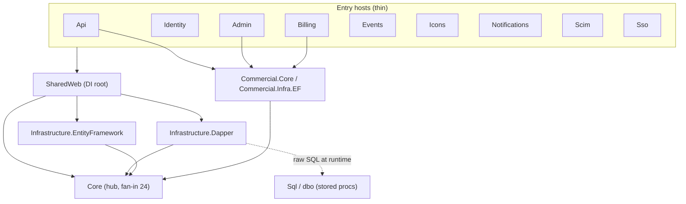

# Repo Map — bitwarden/server (Onboarding Synthesis)

_Read time ~15 min. Window: last 12 months (≈2025-06 → 2026-06), 1,461 non-merge commits. Evidence = git history + `<ProjectReference>` graph. Untooled layers marked `unknown`._

---

## 1. TL;DR

bitwarden/server is the **C#/.NET backend monolith** for Bitwarden: a thin set of web hosts over one giant business-logic library (`Core`). All ten hosts (`Api`, `Identity`, `Admin`, `Billing`, `Events`, `EventsProcessor`, `Icons`, `Notifications`, plus commercial `Scim`/`Sso`) depend on `Core` (fan-in **24**) and on `SharedWeb` (fan-in **12**), which is the DI composition root. Work concentrates overwhelmingly in **`Core/AdminConsole`** (orgs/members/policies — #1 every quarter) and **`Core/Billing`**, with `Sql/dbo` stored procedures as a constantly-churning third. The defining piece of tech debt is a **dual data-access stack**: a Dapper + T-SQL-stored-procedure path (SqlServer / cloud) and a parallel Entity Framework path (Postgres/MySql/Sqlite / self-host), chosen at runtime — so most repository changes must be written **twice (or thrice)**. It hurts most in the **AdminConsole 5-layer vertical slice** (controller → service → EF repo → Dapper repo → stored proc → migration). `Core/Constants.cs` (147 feature-flag keys) is a repo-wide merge-conflict magnet that co-changes with every module.

_(dotted edge = runtime-only, invisible to the project graph)_

## 2. Territory — big responsibility vs periphery

- **Deep / high-responsibility (read these to understand the product):** `Core/AdminConsole` (1,048 commits), `Core/Billing` (621), `Core/Auth` (275), `Core/Vault`, `Core/KeyManagement`. These are deep modules: lots of logic, lots of change.
- **Shallow / glue:** the hosts (`Api`, `Identity`, …) are thin controller+config shells over Core. `SharedWeb` is small but _highly leveraged_ (one DI file wires everything).
- **Periphery / tooling:** `util/Seeder` (active new test-data tooling, 416 commits), `Migrator`, `Icons`, `Notifications`, `Events` — low product-logic weight.
- **Activity over time:** AdminConsole is #1 in **all five quarters**. Billing is a steady #2. Rotating secondary pushes: Auth/Identity (2025-Q3) → Dirt reporting (2025-Q4) → MailTemplates (2026-Q1) → SQL schema/`Sql/dbo` (2026-Q2).

## 3. Real couplings (with evidence source)

| Coupling                                                                                                                            | What changes together                                                                                                    | Evidence source                                                                                                                           |
| ----------------------------------------------------------------------------------------------------------------------------------- | ------------------------------------------------------------------------------------------------------------------------ | ----------------------------------------------------------------------------------------------------------------------------------------- |
| **AdminConsole vertical slice** (Api/AdminConsole + Core/AdminConsole + EF/AdminConsole + Dapper/AdminConsole + Sql/dbo + Migrator) | A single org/member feature edits 5–6 dirs across 4 projects                                                             | **git co-change** (93, 49, 46, 45, 35…) — _not_ visible in project graph below the project boundary                                       |
| **Dual data-access seam** (Dapper ↔ EF ↔ Sql/dbo)                                                                                   | A repository method must be implemented as a stored proc (Dapper/SqlServer) **and** an EF method (Postgres/MySql/Sqlite) | **import graph** (`SharedWeb` → both) **+ git** (Dapper↔EF 92, EF↔Sql 90) **+ runtime switch** in `ServiceCollectionExtensions.cs:98-123` |
| **Api ↔ Core**                                                                                                                      | Controller + service edited together (270 co-changes)                                                                    | git + import graph (every host → Core)                                                                                                    |
| **Sql ↔ Migrator**                                                                                                                  | New stored proc ⇒ new hand-written T-SQL migration (114)                                                                 | git only — `Sql` is a `.sqlproj`, **invisible to the C# project graph**                                                                   |
| **Constants.cs ↔ everything**                                                                                                       | Feature-flag key added with each new feature; co-changes with all 12 src modules                                         | git only — invisible to any dependency tool                                                                                               |
| Billing slice (Api/Billing + Core/Billing + Billing/Services)                                                                       | Stripe-facing, lighter DB coupling than AdminConsole                                                                     | git (41, 35) + import graph                                                                                                               |

**`unknown` (untooled):** which concrete services are bound where (runtime DI strings/keyed services), reflection-based resolution, and the full stored-proc ↔ Dapper call mapping. The project graph proves _project_ edges only; the SP layer and DI bindings need source reading or a running app.

## 4. Risk zones

1. **Dual Dapper/EF/Sql data layer** — every repo change is 2–3 parallel edits; forget one provider and it breaks silently. Highest systemic risk.
2. **`Core/AdminConsole`** — busiest + deepest + widest blast radius (5-layer slice); easy to under-scope a change.
3. **`Core/Auth` + `Identity/IdentityServer`** — security-critical AND knowledge-concentrated in a 2-person pair (bus-factor risk).
4. **`SharedWeb/Utilities/ServiceCollectionExtensions.cs`** — 800+-line single DI root; one file decides the live data layer for all hosts. Small change, repo-wide effect.
5. **`Core/Constants.cs`** — mechanically trivial but a constant merge-conflict point; rebase pain on long-lived branches.
6. **`Sql/dbo` stored procedures** — invisible to static C# tooling, hand-synced with EF + migrations; surging in recent quarter. Easy to miss in impact analysis.

## 5. Who to ask (per zone)

| Zone                                  | Ask                       | Backup         |
| ------------------------------------- | ------------------------- | -------------- |
| AdminConsole (orgs/members/policies)  | **Rui Tomé**              | Thomas Rittson |
| Billing / Stripe                      | **Alex Morask**           | Stephon Brown  |
| Auth / Identity / 2FA / SSO grants    | **Ike**, **Jared Snider** | Todd Martin    |
| Data-access seam (Dapper/EF/Sql sync) | **Jared McCannon**        | Rui Tomé       |
| Dirt (reporting/insights)             | **Vijay Oommen**          | Graham Walker  |
| Cross-cutting / platform / DI / infra | **Justin Baur**           | —              |

_(Bots and automation accounts — renovate, dependabot, Github Actions, sven-bitwarden — filtered out.)_

## 6. First day — read in this order

1. `bitwarden-server.slnx` — the full project list and folder grouping (AGPL vs Bitwarden License vs util/test).
2. `src/SharedWeb/Utilities/ServiceCollectionExtensions.cs` — **the DI root**; start at `AddDatabaseRepositories` (lines ~98-123) to see the Dapper/EF switch.
3. `src/Core/Settings/GlobalSettings.cs` — the config surface (`DatabaseProvider` lives here).
4. `src/Core/Constants.cs` — feature flags = a live index of what's being built.
5. `src/Api/AdminConsole/Controllers/OrganizationUsersController.cs` — the hottest controller; a concrete vertical-slice example.
6. `src/Core/Services/Implementations/UserService.cs` — central, high-churn business logic.
7. One repository in **both** forms side-by-side, e.g. `Infrastructure.EntityFramework/AdminConsole/Repositories/OrganizationUserRepository.cs` vs its Dapper twin + the matching `Sql/dbo` stored proc — to _feel_ the dual-stack tax.
8. `src/Core/AdminConsole/` folder layout — the domain you'll touch most.

## 7. Limitations

- **Window:** only the last **12 months** of git history. Older architectural decisions and long-dormant-but-critical code are under-weighted.
- **Method:** churn ≠ importance — a stable, never-edited security primitive can be vital yet invisible here. Co-change counts show correlation, not causation.
- **Project graph blind spots:** it sees **assembly references only**. It does **NOT** see (a) which concrete service is bound at runtime (DI strings / keyed / reflection), (b) the **`Sql/dbo` stored-procedure layer** (a `.sqlproj` with no C# edges — but git shows it as one of the most-coupled layers), or (c) namespace/type-level coupling inside a project. These are `unknown`, not "uncoupled."
- **Author data** approximate: based on commit author name; squash-merges attribute a whole PR to one author, and identity aliasing (e.g. "Jared" vs "Jared McCannon") may split/merge a person. Verify the "who to ask" names with the team before relying on them.
- **Not validated by build/run:** no source was read broadly and the solution was not built; the Dapper↔EF↔Sql runtime behavior is inferred from one DI method + git, and should be confirmed by a maintainer.
